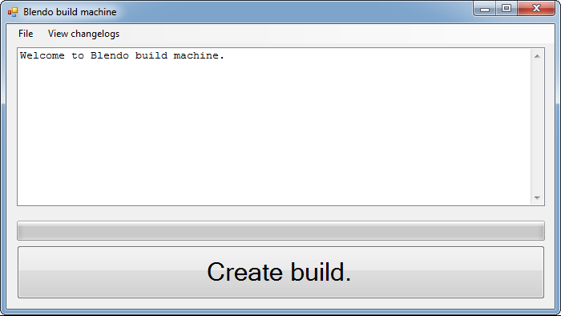

# Blendo build machine

## About
Blendo build machine gives teammates a one-click way of acquiring a new build.

The purpose of this is:
- Make it frictionless & easy for teammates to acquire the latest build.
- Remove the bottleneck of waiting for someone else to create a new build.

**Important note:** this program assumes you're using Subversion source control & have Microsoft Visual Studio compiler tools installed. If you want it to use other tools, you'll need to modify my source code.

This is written in C# and a .sln solution for Visual Studio 2010 is provided. Windows only.

Pre-compiled binaries are available at [my itch.io page](https://blendogames.itch.io/blendobuildmachine).

## What does it do?
Here is what Blendo build machine does when you click the big **Create build** button:
1. Download latest data & code from your Subversion source control repository.
2. Use command-line compiler tools to create a new build.

## License
This source code is licensed under the zlib license. Read the license details here: [LICENSE.md](https://github.com/blendogames/blendobuildmachine/blob/master/license.md)

## Credits
by [Brendon Chung](http://blendogames.com)